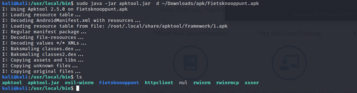

# Reversing an Android Application
In this, I will reverse an Android application. 

## Preparing to Reverse
First off, to choose an application. I chose Fietsknooppunt, because I've worked with it before and I was curious how it worked under the hood. I thought it was a good application, although the UI seems a bit outdated and clunky. It seems like it was made by who made fietsknooppunt.nl as well, so it seemed interesting enough. There is a lot of functionality in there as well; you can login, save routes, find friends, find their routes, and more. 

### Downloading the APK
I was on Kali linux, and since you can't really download an APK directly from the play store, I had to use something different. I used [APK Downloader](https://apps.evozi.com/apk-downloader/?id=nl.vv.fietsknoop) from Evozi to download the APK to my Kali. 

After that, I used APKtool to extract the .apk and turn it into something humanly readable, like Smali. It also allowed me to see most of the source code. It took me a bit to install it, as it's quite different on Kali than on a Windows, for example. 

I also downloaded jadx-gui to make viewing the files easier. 

With this, I could start going through the code itself. It took a while to really understand what the smali was saying and what it all meant. 

### PDF
I compiled any findings in this PDF. 

[pdf](resources/ReversingAndroid.pdf)