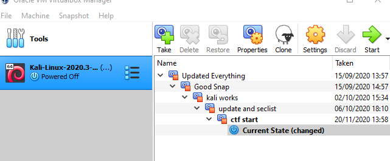
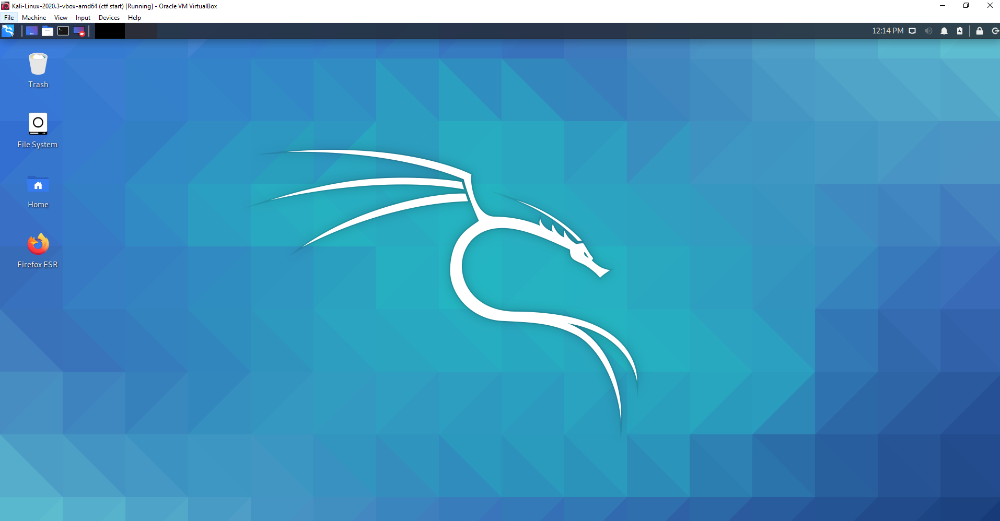
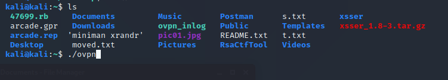

# Kali Environment
To pentest, you would of course need a proper environment to test in. I decided to pick Kali linux, because I have the most experience with that particular OS and it comes with plenty of programs pre-installed. 

## Setup
At first, the setup was fairly standard; I picked an image from the Kali website and I deployed it on VirtualBox. I used the latest at the time, and updated it so that it was as current as possible. I always try to update it before I use it, in case there are any updates I'd need. I also snapshot it before and after important events, like the Hack the Box event. 

## Programs
I also added a few more programs as I needed them. I added Ghydra to try out reverse-engineering, which I needed during the HTB ctf. I also installed XSSer which I used while pentesting. Lastly, I installed Postman to use alongside curl.

# HTB
For Hack the Box, I use a special script to quickly log myself in so I don't have to type the command every time. 
